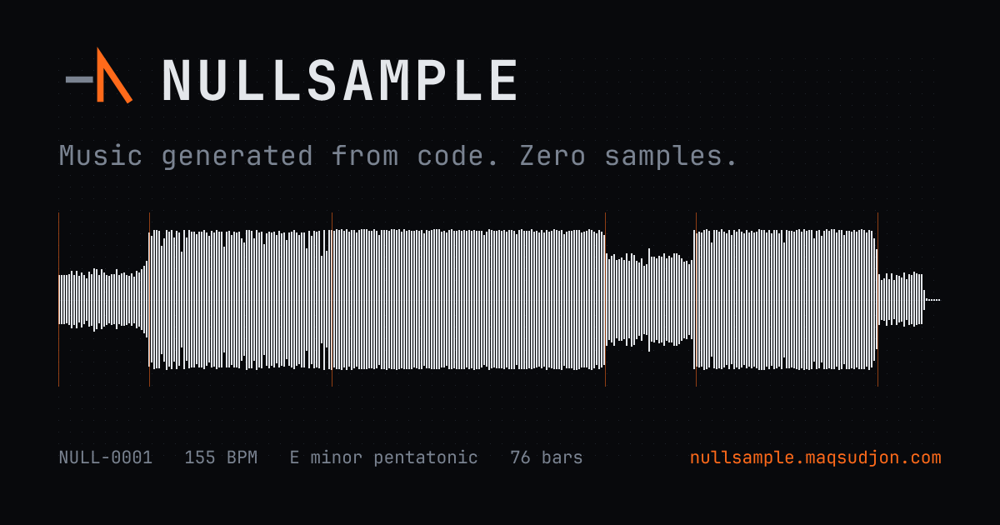

<p align="center">
  
</p>

# Nullsample

**Music generated from code. Zero samples.**

A procedural music generator. Original tracks synthesised entirely from code —
no samples, no loops, no machine learning models, no copyrighted audio. Every
sound comes from oscillators, noise, envelopes, filters and nonlinear stages
computed at runtime, on your own device.

**Live: [nullsample.maqsudjon.com](https://nullsample.maqsudjon.com)** ·
[How it works](https://nullsample.maqsudjon.com/about/) ·
[20 demo seeds](https://nullsample.maqsudjon.com/tracks/)

---

## Zero samples, precisely

There is no audio file anywhere in this repository or on the site. No one-shots,
no loops, no impulse responses for the reverb, no trained model. The reverb is a
feedback delay network with a procedurally generated decay; the drums are
synthesised per hit; the "vocal" texture is a band-passed saw with formant peaks
and is not an imitation of a singer.

That means there is nothing in a track you generate that came from anyone else's
recording. **Audio you generate is yours**, under either licence, including for
commercial release.

## The same seed always gives the same track

A seed is the only input. Paste one and you get that exact track — on any
machine, in any browser, today or in ten years.

This is harder than it sounds, and it is the constraint that shaped the whole
engine. ECMAScript specifies `+`, `-`, `*` and `/` exactly, but explicitly
leaves `Math.sin`, `Math.cos`, `Math.tan`, `Math.exp`, `Math.log`, `Math.pow`
and `Math.sqrt` as *implementation-approximated* — and V8, JavaScriptCore and
SpiderMonkey really do differ in the last bit. One differing bit inside a
filter's feedback path is audible within a second.

So the engine calls none of them. `core/dmath.ts` rebuilds them from exact
arithmetic — polynomial series and a fixed number of Newton steps — accurate to
about 1e-15 and identical on every host. `tools/lint-determinism.mjs` fails the
build if any file under `core/`, `compose/`, `presets/` or `render/` calls the
built-in versions, and `npm run test:browser` renders the same seeds in Node and
in headless Chrome and compares the files byte for byte.

The web app renders progressively — playback starts after a few bars while the
rest computes — and the master chain is fully streaming, so **the audio you hear
and the file you download are the same bytes**. That is asserted by a test, not
assumed.

## Running it

Requires Node 22.6 or later. The engine runs unbundled under Node's type
stripping, so there is no build step for the CLI or the tests.

```bash
npm install          # three dev dependencies; the engine itself has none
npm run verify       # lint, typecheck, tests
```

### Render a track

```bash
npm run render -- --seed 42 --out track.wav
npm run render -- --seed 42 --darker 0.5 --harder -0.3
npm run stems  -- --seed 42 --out stems-42.zip
npm run bench
```

### The quality loop

This is the mechanism that makes the output good, and it is not optional
tooling. Render a batch, listen, rate, narrow the ranges, repeat.

```bash
npm run batch  -- --preset hyperpop --count 50 --out ./batch
npm run sheet  -- ./batch          # writes ./batch/sheet.html
# open ./batch/sheet.html directly — no server needed — rate with 1..5,
# press "Save ratings.json", move it into ./batch/
npm run narrow -- ./batch
```

`narrow` correlates every sampled parameter against your ratings, runs a
permutation test so it does not chase noise, and proposes a tightened ranges
file plus a readable diff. **It never overwrites the ranges file.** The preset is
done when fewer than 5 in 100 random renders are rated poor.

### The web app

```bash
npm run brand        # regenerates every icon and the OG card from one mark
npm run build        # static site into dist/
node tools/serve.mjs # preview on http://localhost:4321
```

## Adding a preset

The boundary between `core/` and `presets/` is the most important structural
decision here. `core/` is generic machinery that knows nothing about genre;
`presets/` is data and recipe logic that knows nothing about DSP internals.
**If you need to edit `core/` to change how something sounds, the boundary is in
the wrong place.**

A preset is two files:

- `presets/<name>.ts` — pattern banks, arrangement templates, harmony options,
  and the word-slider mappings. Structure and taste.
- `presets/<name>.ranges.json` — every numeric parameter as a range with a
  distribution. Separate from code because `narrow` rewrites it.

Register it in `presets/index.ts`. Nothing else needs to change.

## Layout

```
core/       DSP primitives. Deterministic maths, oscillators, filters,
            nonlinear stages, drums, the 808. Frozen after M1.
compose/    Musical decisions: harmony, motif, rhythm, arrangement.
presets/    Genre recipes and parameter ranges. The real work lives here.
render/     Plan, bus renderers, streaming master chain, WAV, ZIP.
cli/        Batch renderer, contact sheet, narrowing.
web/        Static app. Engine in a worker, progressive playback.
brand/      One mark definition; every icon and the OG card derive from it.
test/       Determinism, golden files, mix assertions, unit tests.
```

## Performance, honestly

A 117-second track renders in about **15 seconds on an M-series laptop** and
about **26 seconds in Chrome**, at roughly 5–7x realtime. The original spec
asked for 1.5 seconds. That budget is not reachable: 4x oversampling around the
nonlinear stages costs ~1.5 s per oversampled channel-stream and there are seven
of them, and removing every oversampler entirely still leaves ~9 s. Sections 5,
8 and 9 of the spec could not all hold in scalar JavaScript.

Rather than trade quality for it, the budget was replaced with a
**time-to-first-sound** budget — under two seconds — met by rendering
progressively and starting playback after the first bars. Render throughput
stays well above realtime on a phone, so playback stays ahead of the playhead;
if it ever does not, the app pauses and buffers rather than glitching.

## Licence

Dual.

- **Engine: [AGPL-3.0-or-later](LICENSE).** Use it, modify it, run it. If you
  run a modified version as a network service, publish your source.
- **Commercial: [LICENSE-COMMERCIAL.md](LICENSE-COMMERCIAL.md).** For embedding
  in closed-source products, or for the tuned preset range files.
- **Preset ranges: [presets/LICENSE-PRESETS.md](presets/LICENSE-PRESETS.md).**
  The v1 ranges committed here are AGPL. Tuned range files are the commercial
  asset and are licensed separately.

**Audio you generate is yours under either licence**, including for commercial
release.

JetBrains Mono is used under the SIL Open Font License (`web/fonts/OFL.txt`).
